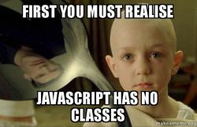
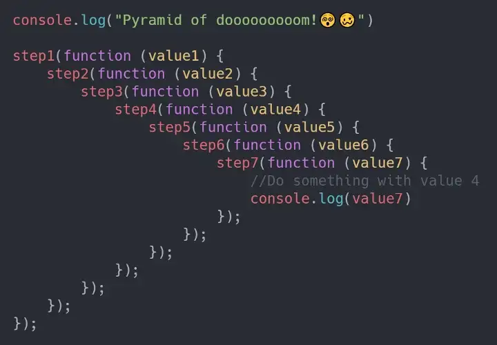
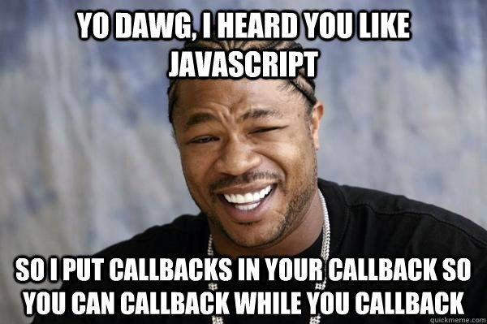
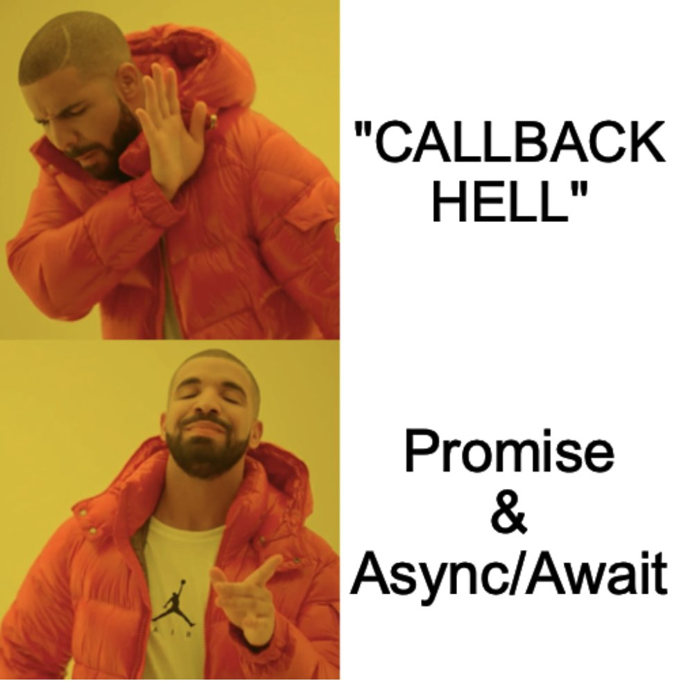
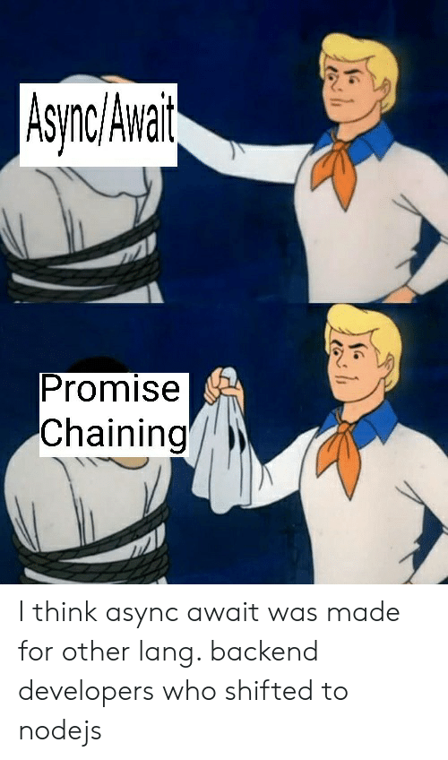

<h1 aligin="center">  Session 3 - OOP + Promises + Async/Await </h1>

## Contents 

1. [OOP](#oop)
2. [The Theory Of How OOP Work In JavaScript](#oop-theoretically-in-javascript)
3. [Hands On OOP With Js](#oop-with-js)
	  1. [Main Concepts : Class,Object,Methods,Constructor](#1-class-constructor-objects-methods)
	  2. [Inheritance](#2-inheritance)
	  3. [Encapsulation](#3-encapsulation)
	  4. [Abstraction](#4-abstraction)
	  5. [Polymorphism](#5-polymorphism)

4. [Promises](#promises)
6. [Async/Await](#async-await)


<br><br>

---

<br><br>

## OOP 

### So  What is Meaning By OOP ? 

- Object-oriented programming (OOP) is a programming paradigm that uses objects, which are instances of classes, to represent and manipulate data. OOP is based on the concept of "objects", which can contain data and code that manipulates that data, as well as the idea of "classes", which can be thought of as templates for creating objects.

- In OOP, a class defines the properties (data) and methods (functions) that an object of that class will have. Objects are instances of a class and can be created using the class as a blueprint. Classes can also inherit characteristics from parent classes, a feature called inheritance.

- Some of the key principles of OOP include:

1. Encapsulation: the idea that the implementation details of an object should be hidden from the outside world, and that the object should only expose a public interface for interacting with its data.

2. Abstraction: the idea that an object should be thought of in terms of its behavior and properties, rather than its implementation details.

3. Inheritance: the ability of a class to inherit properties and methods from a parent class.

4. Polymorphism: the ability of an object to take on multiple forms, depending on the context in which it is used.

<br><br>

---

<br><br>

## OOP Theoretically in JavaScript

- In JavaScript, prototypes are a mechanism for object-oriented programming and inheritance. Each object in JavaScript has a prototype property that references another object, known as its "prototype object". When you access a property or method on an object, JavaScript first looks for that property or method on the object itself. If it can't find it, it looks for it on the object's prototype, and if it can't find it there, it looks for it on the prototype's prototype, and so on, until it reaches the top of the prototype chain.

- When you create an object using the object literal notation `({})` or the Object constructor, its prototype is set to Object.prototype, which is the root of the prototype chain in JavaScript.

- You can create a new object that inherits from an existing object by using the Object.create() method. For example:

```
const parent = { name: 'Parent' };
const child = Object.create(parent);
```
- In this example, child inherits from parent, so it has access to the name property defined on parent.

- You can also add properties and methods to an object's prototype by modifying its prototype property.

For example:

```
parent.prototype.greet = function() {
    console.log('Hello, my name is ',this.name);
}
```
- Now any object that inherits from parent (such as child) will have access to the greet method.

- JavaScript also has a way of creating objects with constructor functions, a way of creating objects that emulates classes. When you create an object using a constructor function, its prototype is set to the prototype property of the constructor function. For example:


```
function Parent(name) {
    this.name = name;
}
```

```
const child = new Parent('Child');
```

In this example, child inherits from Parent.prototype, so it has access to any properties and methods defined on Parent.prototype.


- It's worth noting that prototypes are not classes, JavaScript doesn't have classes. Prototypes are objects that serve as the blueprint for other objects in JavaScript, and provide a mechanism for object-oriented programming and inheritance.


#<br><br>

---

<br><br>

# OOP With JS 

### 1. Class ,  Constructor , Objects , Methods 
- In JavaScript, a class is a blueprint for creating objects (a particular data structure), providing initial values for state (member variables or properties), and implementations of behavior (member functions or methods).

- Here is an example of a class declaration in ECMAScript 6 (ES6):

```
class Person {
  
  name 
  age

  constructor(name, age) {
    this.name = name;
    this.age = age;
  }

  sayHello() {
    console.log('Hello, my name is ',this.name,' and I am ',this.age ,'years old.');
  }
}
```
- The constructor method is a special method for creating and initializing an object created with a class. The constructor method is called automatically when the class is instantiated.

Here is an example of how to use the Person class to create an object and call its method:

```
let person1 = new Person("Eslam Mohamed", 21);
person1.sayHello(); // Output: "Hello, my name is Eslam and I am 21 years old."
```

In the example above, new Person("Eslam Mohamed", 21) creates a new object and calls the constructor method with the arguments "Eslam Mohamed" and 21. This sets the initial values of the name and age properties of the object. Then, the sayHello method is called on the object, which logs a string to the console that includes the values of the name and age properties.

<br><br>

---

<br><br>

### 2. Inheritance 


- Inheritance in object-oriented programming (OOP) is a mechanism that allows a child class to inherit properties and methods from a parent class. This allows for code reuse and a clear organization of related classes.

- In ES6, the class syntax is used to create classes and the `extends` keyword is used to create a child class that inherits from a parent class.

- Here's an example of a simple `Person class` that is used as a parent class:

```
class Person {
 
 name
 age
  
  constructor(name, age) {
    this.name = name;
    this.age = age;
  }
  
  greet() {
    console.log('Hello, my name is ',this.name,' and I am ',this.age, 'years old.');
  }
}
```
And here's an example of a Student class that inherits from the Person class:
```
class Student extends Person {
 
 major
 
 constructor(name, age, major) {
    super(name, age);
    this.major = major;
  }
  
  study() {
    console.log('I am studying ',this.major,'.');
  }
}
```
In this example, the `Student class` inherits the `name `and `age` properties and the `greet()` method from the `Person class`. It also has its own major property and study method.
You can also use instance of `Student class` to access the properties and methods of `Person class`

```
let student = new Student("eslam mohamed", 21, "Computers && Information Technology");
student.greet();  // Output: "Hello, my name is eslam mohamed and I am 21 years old."
student.study();  // Output: "I am studying Computers && Information Technology."
```
- In this way, the `Student class` can inherit properties and methods from the `Person class`, while also having its own unique properties and methods.

---

### 3. Encapsulation 


- Encapsulation in object-oriented programming (OOP) is a mechanism that allows for the hiding of an object's internal state and methods from the outside world. This promotes data hiding and abstraction, making the code more secure and easier to maintain.

- In ES6, encapsulation can be achieved using the class syntax and the private and protected access modifiers.

- Here's an example of a simple `Person class` that uses encapsulation:

```
class Person {

#name
#age

  constructor(name, age) {
    this.#name = name;
    this.#age = age;
  }
  
  greet() {
    console.log('Hello, my name is ',this.#name,' and I am ',this.#age, 'years old.');
  }

}
```
- In this example, the `name` and `age` properties are marked as `private` by prefixing them with a hashtag (`#`). This means that they can only be accessed from within the class and not from outside.

- And if you want to access these properties you can use Getters and Setters

```
class Person {
  constructor(name, age) {
    this.#name = name;
    this.#age = age;
  }
  
  get name(){
    return this.#name;
  }
  set name(name){
    this.#name = name;
  }
  greet() {
    console.log('Hello, my name is ',this.#name,' and I am ',this.#age,' years old.');
  }
}
```
In this example, you can access the `name` and `age` properties using the getters and setters.

```
let person = new Person("Eslam Mohamed", 21);
console.log(person.name);  // Output: "Eslam Mohamed"
person.name = "Abdo";
console.log(person.name);  // Output: "Abdo"
```
- Encapsulation allows you to control the access to the properties and methods of a class, making the code more secure and maintainable. It also allows for a clear separation of concerns, making it easier to understand and change the code.


<br><br>

---

<br><br>

### 4. Abstraction 

- abstraction in object-oriented programming (OOP) is a mechanism that allows for the hiding of an object's complexity from the outside world, exposing only the essential features. This promotes code reusability, modularity, and maintainability.
- According to ES6, you can use JavaScript classes and inheritance to accomplish what you need.

- JavaScript classes, introduced in ECMAScript 2015, are primarily syntactical sugar over JavaScript's existing prototype-based inheritance.


- First of all, we define our abstract class. This class can't be instantiated, but can be extended. We can also define functions that must be implemented in all classes that extends this one.
```
/**
 * Abstract Class Animal.
 *
 * @class Animal
 */
class Animal {

  constructor() {
    if (this.constructor == Animal) {
      throw new Error("Abstract classes can't be instantiated.");
    }
  }

  say() {
    throw new Error("Method 'say()' must be implemented.");
  }

  eat() {
    console.log("eating");
  }
}
```
- After that, we can create our concrete Classes. These classes will inherit all functions and behaviour from abstract class.

```
/**
 * Dog.
 *
 * @class Dog
 * @extends {Animal}
 */
class Dog extends Animal {
  say() {
    console.log("bark");
  }
}

/**
 * Cat.
 *
 * @class Cat
 * @extends {Animal}
 */
class Cat extends Animal {
  say() {
    console.log("meow");
  }
}

/**
 * Horse.
 *
 * @class Horse
 * @extends {Animal}
 */
class Horse extends Animal {}
And the results...

// RESULTS

new Dog().eat(); // eating
new Cat().eat(); // eating
new Horse().eat(); // eating

new Dog().say(); // bark
new Cat().say(); // meow
new Horse().say(); // Error: Method say() must be implemented.
```

- Abstraction allows you to hide the implementation details of a class, exposing only the essential features. It also allows for a clear separation of concerns, making it easier to understand and change the code. It also helps in creating a common interface for subclasses and it's a way to achieve polymorphism.

<br><br>

---

<br><br>

### 5. Polymorphism

- Polymorphism in object-oriented programming (OOP) is a mechanism that allows objects of different classes to be treated as objects of a common class. This promotes code reusability, modularity, and maintainability.

- In ES6, polymorphism can be achieved by using the class syntax and inheritance.

- Here's an example of a simple `Person class` that has a `display()` method:

```
class Person {
name
age
    constructor(name, age) {
    this.name = name;
    this.age = age;
  }

  display() {
    console.log('Name: ',this.name,' Age: ',this.age);
  }
}
```
And here's an example of a `Student class` that extends the `Person class` :

```
class Student extends Person {
grade
    constructor(name, age, grade) {
    super(name, age);
    this.grade = grade;
  }

  display() {
    console.log('Name: ',this.name,' Age: ',this.age,' Grade: ',this.grade );
  }
}
```

- In this example, the `Student class` extends the `Person class`, it provides its own implementation of the `display()` method and it also inherits the name and age properties from the `Person class`.

- And you can use an array of object of Person and Student

```
let person1 = new Person("Eslam Mohamed", 21);
let person2 = new Student("Abdo", 21, "A");
let persons = [person1, person2];

for(let i=0; i<persons.length; i++) {
    persons[i].display();
}
```

- In this example, the `display()` method of the `Person class` is called for the `person1 object`, and the `display()` method of the `Student class` is called for the `person2 object`. This is called polymorphism, as the `display()` method can be called on objects of different classes but produce different results based on the class of the object.

- Polymorphism allows you to use objects of different classes in a similar way, making the code more reusable and maintainable. It also allows for a clear separation of concerns, making it easier to understand and change the code.

<br><br>

---

<br><br>





## Promises 


- In JavaScript, a promise is an object that represents the eventual completion (or failure) of an asynchronous operation, and its resulting value. Promises were introduced in ECMAScript 6 (ES6) as a way to handle asynchronous operations in a more elegant and maintainable way than using callbacks.

- A promise is in one of three states:
>
> **`pending`**: ***the initial state, neither fulfilled nor rejected.***
>
> **`fulfilled`**: ***meaning that the operation completed successfully.***
>
> **`rejected`**: ***meaning that the operation failed.***
>
> A promise is said to be **`settled`** if it is either fulfilled or rejected.
>

- Here's an example of a simple promise that wraps a `setTimeout` function:

```
let promise = new Promise((resolve, reject) => {
  setTimeout(() => {
    resolve("Hello World!");
  }, 1000);
});
```

In this example, we create a new promise by passing a function to the Promise constructor. This function takes two arguments, resolve and reject, which are functions that can be called to change the state of the promise. In this example, we call resolve("Hello World!") after 1 second, which changes the state of the promise to fulfilled and makes the resolved value "Hello World!" available to any code that is listening for the promise to be settled.

- To use the promise, we can attach a `.then()` method to it, which takes a single argument, a function that is called when the promise is `fulfilled`:

```
promise.then((value) => {
  console.log(value);
});
```

In this example, the function passed to .then() will be called with the resolved value of the promise, which is "Hello World!", and it will log the value to the console.

- We can also attach a `.catch()` method to the promise, which takes a single argument, a function that is called when the promise is rejected.

```
let promise = new Promise((resolve, reject) => {
  setTimeout(() => {
    reject(new Error("Something went wrong!"));
  }, 1000);
});
promise.catch((error) => {
  console.log(error);
});
```

- In this example, the function passed to `.catch()` will be called with the rejected value of the promise, which is an error object with the message "Something went wrong!", and it will log the error to the console.

- Promise also provides a `.finally()` method which is called when the promise is settled regardless of whether the promise is fulfilled or rejected.

- Promise allows you to handle asynchronous operations in a more elegant and maintainable way than using callbacks. It also allows for a clear separation of concerns, making it easier to understand and change the code. It also helps in handling errors in a better way.


<br><br>

---

<br><br>



## Async / Await

- `async/await` is a way of writing asynchronous code that makes it look and behave more like synchronous code. It was introduced in ECMAScript 2017 (ES8) as a syntax sugar on top of promises. It allows you to write asynchronous code that looks similar to synchronous code, making it easier to read and understand.

- `async` is a keyword that is used to define an asynchronous function. An asynchronous function is a function that returns a promise and can be await-ed.

```
async function example() {
  // asynchronous code here
}
```

- `await` is a keyword that is used inside an asynchronous function to pause the execution of the function until a promise is `settled` (`fulfilled` or `rejected`).

```
async function example() {
  let result = await promise;
  // the code execution will pause here until the promise is settled
  // after the promise is settled, the value of the promise will be assigned to the variable 'result'
  // the rest of the code will continue to execute
}
```

For example, consider a simple promise that wraps a setTimeout function:

```
let promise = new Promise((resolve) => {
  setTimeout(() => {
    resolve("Hello World!");
  }, 1000);
});
```
Here is an example of using async/await with the above promise:

```
async function example() {
  let result = await promise;
  console.log(result); // logs "Hello World!" after 1 second
}

example();
```

In this example, the await keyword is used to pause the execution of the example() function until the promise is settled. Once the promise is settled, the resolved value "Hello World!" is assigned to the result variable, and the rest of the function continues to execute, logging the result to the console.

- In case of any error occured in the promise, we can use try-catch block to handle the error

```
async function example() {
    try {
       let result = await promise;
       console.log(result); 
    } catch (error) {
        console.log(error);
    }
}
example();
```
- `async/await` makes it easy to write asynchronous code that looks and behaves like synchronous code. It is a more readable and maintainable way of handling asynchronous operations compared to using callbacks or chaining promises.


<br><br>

---

<br><br>


